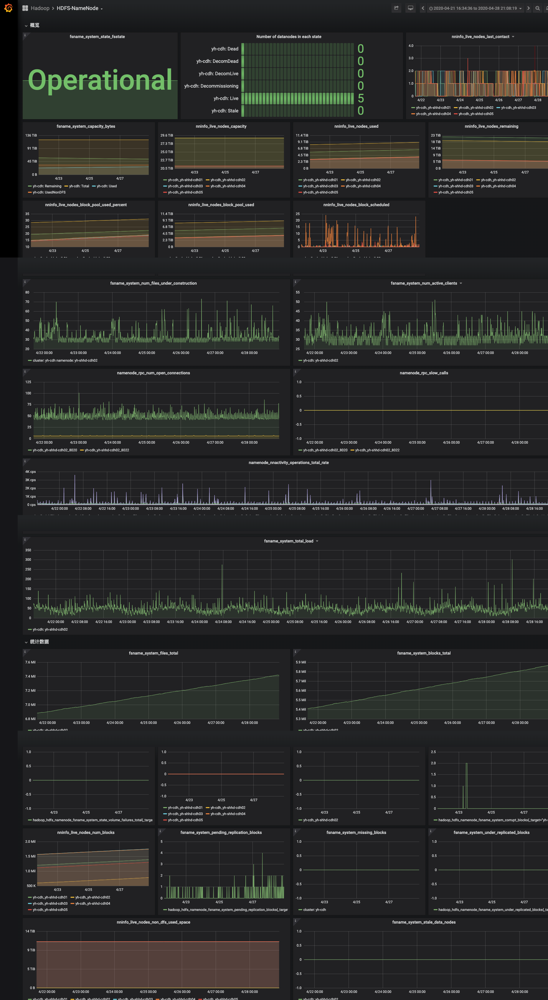

# hadoop_jmx_exporter

Hadoop HDFS & YARN jmx metrics prometheus exporter.

All metrics can be found [here](./examples/all_metrics.txt).

Grafana dashboards json file and a short video demo in [dashboards](./dashboards) directory.

Tested on CDH 5.14.2.



# Run

``` bash
➜  hadoop_jmx_exporter git:(master) ✗ pip2 install -r requirements.txt

➜  hadoop_exporter git:(master) ✗ python2 hadoop_jmx_exporter.py -h
usage: hadoop_jmx_exporter.py [-h] -cluster cluster_name
                              [-queue yarn_queue_regexp]
                              [-nns [namenode_jmx_url [namenode_jmx_url ...]]]
                              [-rms [resourcemanager_jmx_url [resourcemanager_jmx_url ...]]]
                              [-jns [journalnode_jmx_url [journalnode_jmx_url ...]]]
                              [-host host] [-port port]

hadoop jmx metric prometheus exporter

optional arguments:
  -h, --help            show this help message and exit
  -cluster cluster_name
                        Hadoop cluster name (maybe HA name)
  -queue yarn_queue_regexp
                        Regular expression of queue name. default: root.*
  -nns [namenode_jmx_url [namenode_jmx_url ...]]
                        Hadoop hdfs namenode jmx metrics URL.
  -rms [resourcemanager_jmx_url [resourcemanager_jmx_url ...]]
                        Hadoop resourcemanager metrics jmx URL.
  -jns [journalnode_jmx_url [journalnode_jmx_url ...]]
                        Hadoop journalnode jmx metrics URL.
  -host host            Listen on this address. default: 0.0.0.0
  -port port            Listen to this port. default: 6688
➜  hadoop_exporter git:(master) ✗

➜  hadoop_exporter git:(master) ✗ python2 hadoop_jmx_exporter.py -cluster yh-cdh -nns http://10.193.40.10:50070/jmx http://10.193.40.3:50070/jmx -rms http://yh-shhd-cdh04:8088/jmx http://yh-shhd-cdh01:8088/jmx
Listen at 0.0.0.0:6688
```

Open your browser to view metrics: `http://127.0.0.1:6688/metrics`.

# Reference

1. https://github.com/cauwulixuan/hadoop_exporter
2. http://hadoop.apache.org/docs/r2.7.3/hadoop-project-dist/hadoop-common/Metrics.html#namenode
3. https://docs.cloudera.com/HDPDocuments/Ambari-2.7.5.0/using-ambari-core-services/content/amb_hdfs_users.html
4. https://www.datadoghq.com/blog/collecting-hadoop-metrics/
